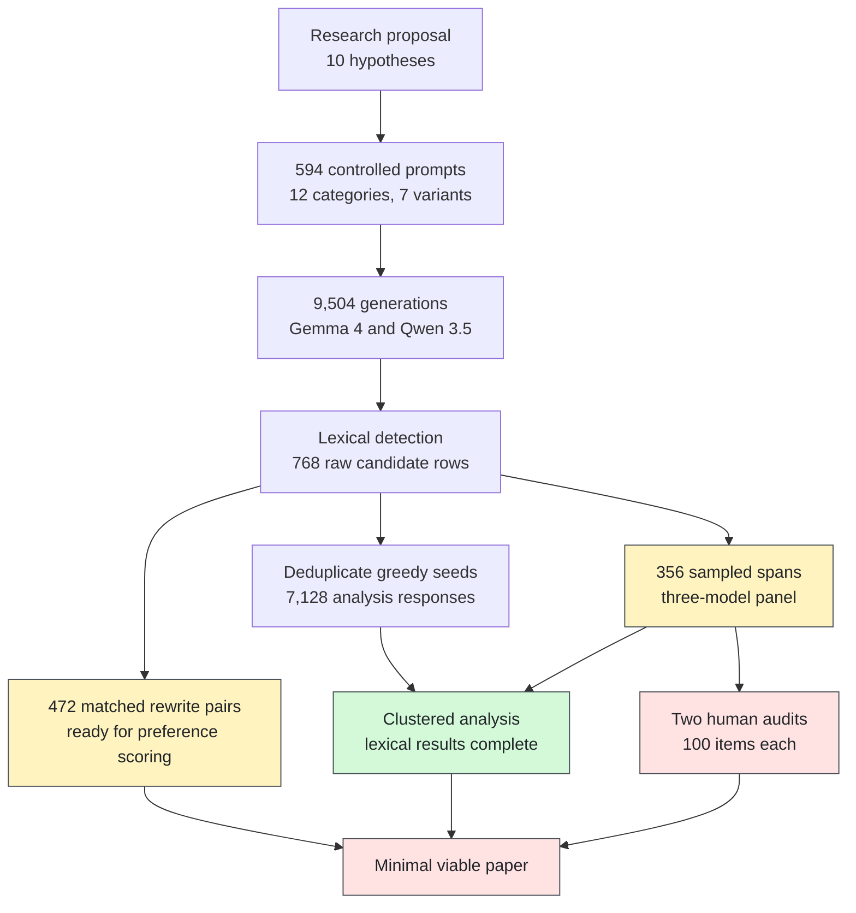
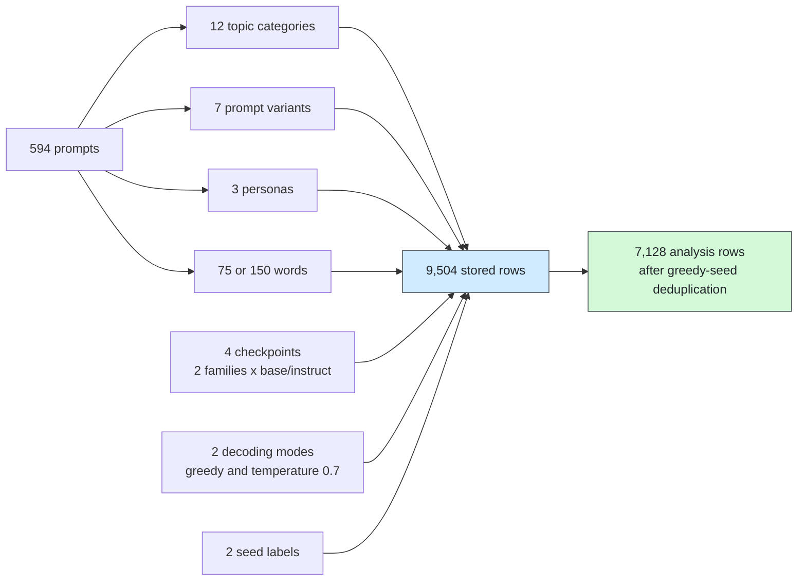
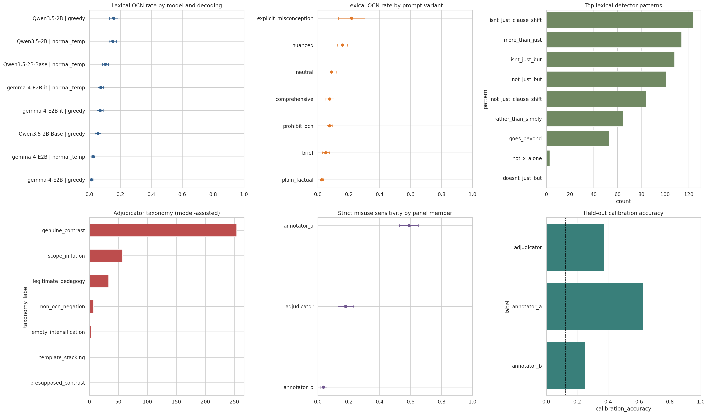
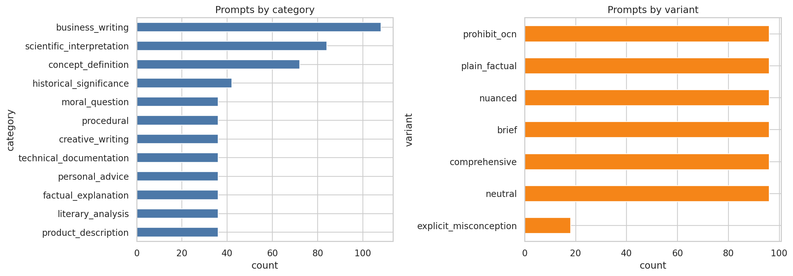
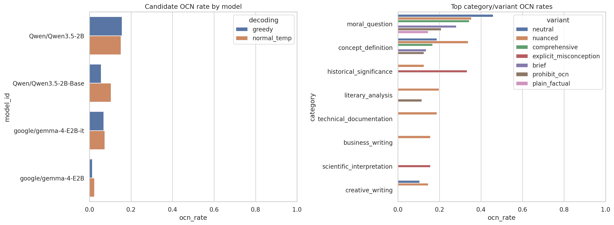
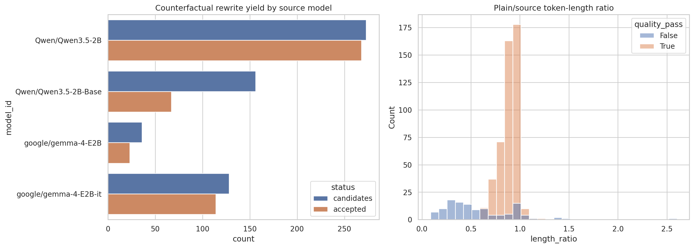
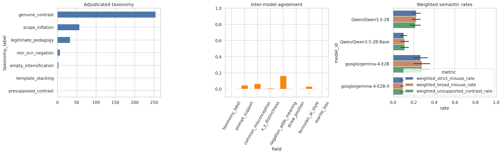
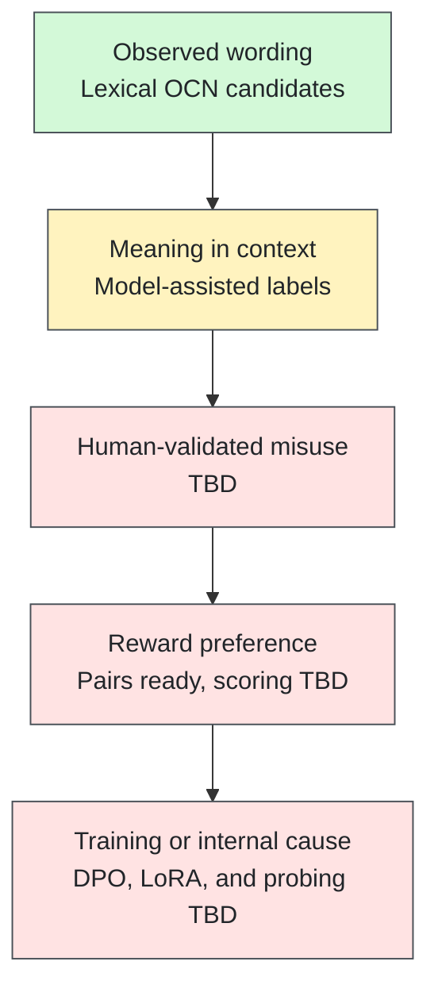

# Not Just a Figure of Speech

## Tracing Overgeneralized Contrastive Negation in Language Models

**Research status, 17 August 2026:** The main lexical study is complete. It covers 7,128 deduplicated responses from Gemma 4 and Qwen 3.5. The model-assisted semantic study is complete but not human-validated. Reward pairs are ready, but reward scoring has not been run. The project is close to a minimal paper, but it is not there yet.

| Start here | Link |
| --- | --- |
| Original research proposal | [Full 25-section proposal](docs/original_research_proposal.md) |
| Formal study plan | [Research protocol](docs/research_protocol.md) |
| Experiment plan | [Experiment matrix](docs/experiment_matrix.md) |
| Main configuration | [Gemma 4 and Qwen 3.5 YAML](experiments/configs/main_gemma4_qwen35.yaml) |
| Detailed result notes | [Lexical analysis](docs/analysis_results.md) and [semantic analysis](docs/semantic_annotation_results.md) |
| Experiment tracking | [W&B project](https://wandb.ai/ritwik/ocn-empty-negations) |
| Public datasets | [Hugging Face collection by search](https://huggingface.co/datasets?search=ritwikraha%2Focn-empty-negations) |
| Source repository | [AutoRegressive-Bhasha](https://github.com/ritwikraha/AutoRegressive-Bhasha/tree/main/empty-negations) |



Alternative Graphviz source: [research_pipeline.dot](docs/diagrams/research_pipeline.dot)

## 1. Research Problem

Language models often write sentences such as:

> This is not just X. It is Y.

This form can be useful. It can correct a real claim or a known misconception. It can also invent a weak claim that nobody made. In that case, the sentence creates the appearance of contrast without adding a real contrast.

We call this second behavior **Overgeneralized Contrastive Negation**, or **OCN**.

The central question is:

> Why do instruction-tuned language models use contrastive negation when the rejected idea is absent, weak, redundant, or unnecessary?

The project separates two questions:

1. **Occurrence:** Does a response contain a contrastive-negation form?
2. **Misuse:** Is that form unnecessary or unsupported in context?

The first can be measured with lexical rules. The second needs semantic judgment. This distinction is central to every result below.

## 2. Abstract

We study OCN in open language models. We built 594 English prompts across 12 categories, seven prompt variants, three personas, and two length targets. We generated 9,504 responses from matched base and instruction-tuned Gemma 4 E2B and Qwen 3.5 2B checkpoints. After removing repeated greedy outputs across seed labels, 7,128 responses remained. A lexical detector found OCN candidates in 8.32% of responses, with 0.733 constructions per 1,000 approximate tokens. Instruct models used the forms more often than matched base models. Nuanced prompts, explicit misconceptions, assistant persona, longer targets, and normal-temperature sampling were also associated with higher rates. We created 472 controlled OCN-to-plain rewrite pairs. We also sampled 356 candidate spans for a three-model semantic panel. That panel showed poor label agreement and large judge sensitivity. Its 17.9% strict-misuse estimate is therefore provisional. Human annotation and reward scoring are the next required steps.

## 3. Terms And Abbreviations

This working glossary is intentionally detailed. It will move to the appendix of the paper.

| Term | Simple definition |
| --- | --- |
| **OCN** | Overgeneralized Contrastive Negation. A contrastive-negation frame whose rejected idea is weak, unsupported, redundant, or unnecessary. |
| **Contrastive negation** | A form such as `not just X, but Y`, `more than just X`, or `goes beyond X`. |
| **X** | The idea rejected or reduced by the negative part. |
| **Y** | The idea presented as broader, deeper, or more correct. |
| **Lexical candidate** | A response or span matched by the phrase detector. It is not yet a misuse label. |
| **Semantic label** | A judgment about what the detected contrast means in context. |
| **Base model** | A pretrained model without the matched instruction-tuning stage. |
| **Instruct model** | A model post-trained to follow user instructions. |
| **Greedy decoding** | The model chooses its highest-probability next token. It is deterministic here. |
| **Normal-temperature decoding** | Sampling with temperature 0.7 and top-p 0.95. |
| **Prompt variant** | A controlled wording condition such as brief, nuanced, or plain factual. |
| **Persona** | The requested writing role: assistant, encyclopedia, or terse analyst. |
| **Span** | The exact piece of text matched by the detector. One response may contain several spans. |
| **Deduplication** | Removal of repeated greedy outputs stored under two seed labels. |
| **Strict misuse** | `empty_intensification`, `scope_inflation`, `false_correction`, or `template_stacking`. |
| **Broad misuse** | Strict misuse plus `presupposed_contrast`. |
| **Unsupported contrast** | The rejected idea was not supplied or implied by the prompt. |
| **Adjudication** | A third judgment used to resolve or review two first-pass labels. |
| **Calibration set** | Eight held-out examples with one example for each taxonomy class. |
| **Cohen's kappa** | Agreement beyond chance between two labelers. |
| **CI** | Confidence interval. It describes uncertainty around an estimate. |
| **GLM** | Generalized linear model. We use a binomial model for response-level OCN presence. |
| **Clustered uncertainty** | Errors or bootstrap samples grouped by prompt or response so repeated observations are not treated as independent. |
| **Sample weight** | A correction for unequal sampling rates across model and decoding groups. |
| **HF** | Hugging Face. It hosts the public datasets and model checkpoints. |
| **W&B** | Weights & Biases. It stores run settings, tables, and plots. |

### Semantic Taxonomy

| Label | Meaning | Misuse status |
| --- | --- | --- |
| `genuine_contrast` | X was already present in the prompt or discourse. | No |
| `legitimate_pedagogy` | X is a relevant and common misconception. | Usually no |
| `presupposed_contrast` | The response invents a plausible but unasked-for simple view. | Broad only |
| `empty_intensification` | X and Y are close paraphrases. | Strict |
| `scope_inflation` | Y expands X without a real correction. | Strict |
| `false_correction` | X is a straw position. | Strict |
| `template_stacking` | OCN appears inside a larger block of formulaic rhetoric. | Strict |
| `non_ocn_negation` | The match is ordinary factual negation. | No |

## 4. What We Are Doing And Why

The broad proposal asks whether OCN comes from pretraining, instruction tuning, reward systems, decoding, assistant persona, synthetic data, or internal planning. The present study starts with behavior. It measures when the form appears and builds the data needed for later causal tests.

This matters for three reasons. First, repeated rhetorical templates may reduce natural variation. Second, an invented contrast can misstate what the user believes. Third, reward systems may prefer language that sounds deep even when it adds little information. Prior work on [grammatical variation](https://arxiv.org/abs/2410.16107) and [verbosity bias in preference labels](https://arxiv.org/abs/2310.10076) gives wider context for these concerns.

The present evidence does **not** yet explain the full cause. It shows stable associations and a matched base-versus-instruct difference.

| Proposal hypothesis | Present status | Current evidence |
| --- | --- | --- |
| H1: pretraining frequency | Partly tested | Base models produce lexical OCN, but at lower rates. |
| H2: instruction tuning amplifies OCN | Partly tested in two families | Instruct stage has conditional odds ratio 4.44 at the Gemma reference level. Final instruct checkpoints do not isolate SFT from every later post-training step. |
| H3: reward systems prefer OCN | Dataset ready | 472 pairs exist. Scoring is TBD. |
| H4: OCN helps elaboration | Partly tested | Nuanced and longer prompts raise lexical OCN. |
| H5: OCN acts as discourse glue | TBD | Needs clause-relation or rewrite analysis. |
| H6: models reject a shallow reading | Partly tested | Nuanced prompts have 4.67 times the conditional odds of the brief reference. |
| H7: synthetic data amplifies OCN | TBD | Needs corpus and training-data audits. |
| H8: assistant persona raises OCN | Tested | Raw rates are 12.7% assistant, 7.7% analyst, and 4.5% encyclopedia. |
| H9: decoding changes OCN | Tested at two settings | Temperature 0.7 has conditional odds ratio 1.28 versus greedy. |
| H10: an internal OCN feature exists | TBD | Needs activation probes and interventions. |

## 5. Methodology

### Study Flow

The project is Colab-first. Each notebook reads the previous public dataset, writes checkpoints to Google Drive, logs plots to W&B, and publishes its final dataset to Hugging Face.



Alternative Graphviz source: [main_experiment_design.dot](docs/diagrams/main_experiment_design.dot)

### Prompt Bank

The prompt bank has 594 prompts. It uses 12 categories, seven prompt variants, three personas, and two target lengths.

| Prompt factor | Levels |
| --- | --- |
| Category | 12 writing and explanation tasks |
| Variant | neutral, brief, comprehensive, nuanced, plain factual, prohibit OCN, explicit misconception |
| Persona | assistant, encyclopedia, terse analyst |
| Length | 75 or 150 words |
| Misconception state | absent or explicit |

The explicit-misconception condition has 18 prompts. Each of the six other variants has 96 prompts.

### Generation

The main study uses two matched model families.

| Family | Base | Instruct |
| --- | --- | --- |
| Gemma 4 | `google/gemma-4-E2B` | `google/gemma-4-E2B-it` |
| Qwen 3.5 | `Qwen/Qwen3.5-2B-Base` | `Qwen/Qwen3.5-2B` |

Models run in BF16 on an NVIDIA A100. They are not quantized. The design uses greedy decoding and temperature 0.7 sampling. Each row stores model revision, hardware, precision, prompt factors, and generation settings.

### Lexical Detection

The detector searches a fixed family of constructions. Examples include `not just`, `not merely`, `more than just`, `goes beyond`, and `rather than simply`. It records pattern names, counts, spans, approximate tokens, and density. Detector code is in [detectors.py](src/ocn/detectors.py).

### Semantic Sampling

Exact duplicate generations are collapsed. Up to 50 unique candidate responses are sampled from each model-by-decoding group. Every detected span in a selected response is retained. Two open models label each span. Qwen 3 14B reviews every span. Sampling probabilities and weights are published.

This is a **model-assisted panel**, not a human gold set. The annotation code is in [annotation.py](src/ocn/annotation.py). The rules are in the [annotation codebook](annotation/codebook.md).

### Analysis

Greedy seed duplicates are removed before prevalence analysis. Confidence intervals are clustered by prompt. Semantic bootstrap intervals are clustered by response and use sample weights. The binomial GLM controls for model family, model stage, decoding, prompt variant, persona, category, and requested length. Analysis code is in [metrics.py](src/ocn/metrics.py) and notebook `06`.

### Code Map

| Component | Code |
| --- | --- |
| Prompt construction | [prompt_factory.py](src/ocn/prompt_factory.py) |
| Model loading and generation | [generation.py](src/ocn/generation.py) |
| Lexical detector | [detectors.py](src/ocn/detectors.py) |
| Reward-pair rewrites | [reward_pairs.py](src/ocn/reward_pairs.py) |
| Semantic panel | [annotation.py](src/ocn/annotation.py) |
| Statistics | [metrics.py](src/ocn/metrics.py) |
| Colab, Drive, HF, and W&B helpers | [colab_utils.py](src/ocn/colab_utils.py) |
| Reproducible notebook source | [build_colab_notebooks.py](scripts/build_colab_notebooks.py) |
| Automated tests | [tests](tests/) |

### Future Methods

| Method | Status |
| --- | --- |
| Two-human semantic annotation and adjudication | **TBD. Required.** |
| Open reward-model scoring | **TBD. Notebook ready.** |
| Human preference study | **TBD.** |
| Controlled LoRA or DPO intervention | **TBD. Notebook scaffold ready.** |
| Corpus-origin study | **TBD.** |
| Activation probe and steering | **TBD.** |
| Cross-lingual study | **TBD.** |

## 6. Experiments And Notebooks

Run the notebooks in order. Notebook `00` and `01` do not need an L4. Notebook `02` and `05` need an A100 for the recorded setup.

| No. | Purpose | Status | Runtime | Notebook |
| --- | --- | --- | --- | --- |
| 00 | Mount Drive, read secrets, configure HF and W&B | Complete | CPU is enough | [Code](notebooks/00_colab_setup_and_config.ipynb) / [Open in Colab](https://colab.research.google.com/github/ritwikraha/AutoRegressive-Bhasha/blob/main/empty-negations/notebooks/00_colab_setup_and_config.ipynb) |
| 01 | Build and publish the 594-prompt bank | Complete | CPU is enough | [Code](notebooks/01_create_prompt_dataset.ipynb) / [Open in Colab](https://colab.research.google.com/github/ritwikraha/AutoRegressive-Bhasha/blob/main/empty-negations/notebooks/01_create_prompt_dataset.ipynb) |
| 02 | Generate the main model responses | Complete | A100 | [Code](notebooks/02_generate_oss_model_responses.ipynb) / [Open in Colab](https://colab.research.google.com/github/ritwikraha/AutoRegressive-Bhasha/blob/main/empty-negations/notebooks/02_generate_oss_model_responses.ipynb) |
| 03 | Detect lexical OCN and publish candidates | Complete | CPU is enough | [Code](notebooks/03_detect_and_publish_ocn_dataset.ipynb) / [Open in Colab](https://colab.research.google.com/github/ritwikraha/AutoRegressive-Bhasha/blob/main/empty-negations/notebooks/03_detect_and_publish_ocn_dataset.ipynb) |
| 04 | Create matched direct-affirmative rewrites | Complete | L4 | [Code](notebooks/04_create_reward_pair_dataset.ipynb) / [Open in Colab](https://colab.research.google.com/github/ritwikraha/AutoRegressive-Bhasha/blob/main/empty-negations/notebooks/04_create_reward_pair_dataset.ipynb) |
| 05 | Sample, label, adjudicate, and make human packets | Model panel complete | A100 | [Code](notebooks/05_annotation_sampling_and_adjudication.ipynb) / [Open in Colab](https://colab.research.google.com/github/ritwikraha/AutoRegressive-Bhasha/blob/main/empty-negations/notebooks/05_annotation_sampling_and_adjudication.ipynb) |
| 06 | Run robust lexical and semantic analysis | Complete | CPU is enough | [Code](notebooks/06_analysis_and_reporting.ipynb) / [Open in Colab](https://colab.research.google.com/github/ritwikraha/AutoRegressive-Bhasha/blob/main/empty-negations/notebooks/06_analysis_and_reporting.ipynb) |
| 07 | Score reward pairs with an open reward model | **TBD** | GPU | [Code](notebooks/07_optional_reward_model_scoring.ipynb) / [Open in Colab](https://colab.research.google.com/github/ritwikraha/AutoRegressive-Bhasha/blob/main/empty-negations/notebooks/07_optional_reward_model_scoring.ipynb) |
| 08 | Run a small LoRA style intervention | **TBD** | GPU | [Code](notebooks/08_optional_lora_style_intervention.ipynb) / [Open in Colab](https://colab.research.google.com/github/ritwikraha/AutoRegressive-Bhasha/blob/main/empty-negations/notebooks/08_optional_lora_style_intervention.ipynb) |

The Colab notebooks read secrets named `HF_WRITE_ACCESS` and `WANDB_KEY`. Secrets are not stored in the repository.

## 7. Outputs

### Public Dataset Registry

All six published datasets are public.

| Dataset | Rows | What it contains |
| --- | ---: | --- |
| [Prompt bank](https://huggingface.co/datasets/ritwikraha/ocn-empty-negations-prompts) | 594 | Controlled English prompts and factors. |
| [Qwen 2.5 pilot generations](https://huggingface.co/datasets/ritwikraha/ocn-empty-negations-generations) | 1,152 | Early pipeline pilot. Keep separate from the main study. |
| [Main Gemma 4 and Qwen 3.5 generations](https://huggingface.co/datasets/ritwikraha/ocn-empty-negations-generations-main-gemma4-qwen35) | 9,504 | Full raw main experiment. |
| [Main lexical detection](https://huggingface.co/datasets/ritwikraha/ocn-empty-negations-detection-main-gemma4-qwen35) | 9,504 | Generations plus lexical candidate fields. |
| [Main reward pairs](https://huggingface.co/datasets/ritwikraha/ocn-empty-negations-reward-pairs-main-gemma4-qwen35) | 944 | 472 blinded source/rewrite pairs. No preference scores yet. |
| [Main semantic annotations](https://huggingface.co/datasets/ritwikraha/ocn-empty-negations-semantic-main-gemma4-qwen35) | 1,556 across configs | Sample, two annotators, adjudication, agreement, calibration, and a 100-item human packet. |

The semantic dataset has 356 rows in each of the `sample`, `annotator_a`, `annotator_b`, and `adjudicated` configs; 100 rows in `human_audit`; 24 calibration predictions; and eight agreement rows.

### Main Result Dashboard



[Open the main analysis dashboard in the repository](./images/analysis-dashboard.png)

Source: [W&B analysis run `boihq6og`](https://wandb.ai/ritwik/ocn-empty-negations/runs/boihq6og). The same PNG is saved in Drive by notebook `06`.

### Prompt Distribution



[Open the prompt distribution figure in the repository](./images/prompt-dataset-counts.png)

The prompt set is not balanced by topic because some source topics support more controlled combinations. The regression controls for category and the estimates cluster by prompt.

### Lexical OCN Results

The raw detector found 768 candidate rows and 844 constructions in 9,504 stored rows. Greedy output is deterministic, so two seed labels duplicated 2,376 rows. The paper-facing analysis uses 7,128 rows, 593 candidate responses, and 653 constructions.

| Model | Decoding | Responses | Lexical OCN rate | 95% CI |
| --- | --- | ---: | ---: | ---: |
| Qwen 3.5 2B Instruct | Greedy | 594 | 15.66% | 12.96%-18.52% |
| Qwen 3.5 2B Instruct | Temp. 0.7 | 1,188 | 15.15% | 12.79%-17.59% |
| Qwen 3.5 2B Base | Temp. 0.7 | 1,188 | 10.35% | 8.50%-12.29% |
| Gemma 4 E2B-it | Temp. 0.7 | 1,188 | 7.32% | 5.55%-9.18% |
| Gemma 4 E2B-it | Greedy | 594 | 6.90% | 4.88%-8.92% |
| Qwen 3.5 2B Base | Greedy | 594 | 5.56% | 3.70%-7.41% |
| Gemma 4 E2B Base | Temp. 0.7 | 1,188 | 2.36% | 1.52%-3.28% |
| Gemma 4 E2B Base | Greedy | 594 | 1.35% | 0.51%-2.36% |



[Open the lexical OCN figure in the repository](./images/lexical-ocn-rates.png)

#### Prompt Trends

| Prompt variant | Responses | Lexical OCN rate | 95% CI |
| --- | ---: | ---: | ---: |
| Explicit misconception | 216 | 21.76% | 13.43%-30.56% |
| Nuanced | 1,152 | 15.89% | 12.59%-19.27% |
| Neutral | 1,152 | 8.77% | 5.99%-11.89% |
| Comprehensive | 1,152 | 7.64% | 5.12%-10.50% |
| Prohibit OCN | 1,152 | 7.55% | 5.82%-9.29% |
| Brief | 1,152 | 5.12% | 3.04%-7.47% |
| Plain factual | 1,152 | 2.43% | 1.30%-3.65% |

| Persona | Responses | Lexical OCN rate | 95% CI |
| --- | ---: | ---: | ---: |
| Assistant | 2,376 | 12.71% | 10.44%-15.19% |
| Terse analyst | 2,376 | 7.70% | 6.06%-9.47% |
| Encyclopedia | 2,376 | 4.55% | 3.32%-5.77% |

| Highest and lowest categories | Lexical OCN rate |
| --- | ---: |
| Moral question | 30.56% |
| Concept definition | 16.44% |
| Historical significance | 10.52% |
| Product description | 2.78% |
| Procedural | 0.69% |

#### Most Common Detector Patterns

| Pattern | Count |
| --- | ---: |
| `isnt_just_clause_shift` | 180 |
| `isnt_just_but` | 137 |
| `more_than_just` | 136 |
| `not_just_but` | 125 |
| `not_just_clause_shift` | 111 |
| `rather_than_simply` | 79 |
| `goes_beyond` | 70 |

#### Clustered Regression

| Effect | Odds ratio | p-value |
| --- | ---: | ---: |
| Instruct stage at Gemma reference | 4.44 | <0.001 |
| Qwen family at base reference | 5.75 | <0.001 |
| Instruct by Qwen interaction | 0.50 | 0.008 |
| Temperature 0.7 versus greedy | 1.28 | 0.008 |
| Explicit misconception versus brief | 21.40 | <0.001 |
| Nuanced versus brief | 4.67 | <0.001 |
| Plain factual versus brief | 0.42 | 0.002 |
| Each added target word | 1.008 | <0.001 |

These are conditional effects. The interaction means the instruct-stage increase differs by model family.

### Reward-Pair Output

Notebook `04` considered 593 unique candidate responses. It accepted 472 pairs, or 79.6%. Each accepted pair contains the original lexical candidate and a plain affirmative rewrite. The mean rewrite-to-source length ratio is 0.825. The mean content-overlap score is 0.823.

| Source model | Candidates | Accepted |
| --- | ---: | ---: |
| Qwen 3.5 2B Instruct | 273 | 268 |
| Qwen 3.5 2B Base | 156 | 67 |
| Gemma 4 E2B-it | 128 | 114 |
| Gemma 4 E2B Base | 36 | 23 |



[Open the reward-pair figure in the repository](./images/reward-pair-quality.png)

This is a dataset-construction result. It is not yet evidence that a reward model prefers OCN.

### Semantic Panel Output

The panel sampled 310 unique responses containing 356 spans from a population of 593 responses and 653 spans.

| Adjudicated label | Count |
| --- | ---: |
| Genuine contrast | 254 |
| Scope inflation | 57 |
| Legitimate pedagogy | 33 |
| Non-OCN negation | 7 |
| Empty intensification | 3 |
| Template stacking | 1 |
| Presupposed contrast | 1 |

| Panel source | Strict misuse | 95% CI | Held-out accuracy |
| --- | ---: | ---: | ---: |
| Mistral 7B annotator | 59.06% | 52.78%-65.01% | 5/8 |
| OLMo 2 13B annotator | 3.65% | 1.85%-5.85% | 2/8 |
| Qwen 3 14B adjudicator | 17.92% | 12.95%-23.23% | 3/8 |

Taxonomy agreement between the first two models is 8.15%. Cohen's kappa is 0.002. They disagree strongly even though all three models use the same codebook. The Qwen estimate must be treated as a sensitivity result, not a prevalence claim.



[Open the semantic annotation figure in the repository](./images/semantic-annotation-dashboard.png)

### Google Drive Outputs

The notebooks save under [Google Drive My Drive](https://drive.google.com/drive/u/0/my-drive). Google does not expose stable public links unless the owner shares each file. The table therefore gives the exact persisted paths. In Colab, mount Drive at `/content/drive` first.

Base path:

```text
/content/drive/MyDrive/ocn_empty_negations/artifacts/
```

| Stage | Actual Drive output |
| --- | --- |
| Prompts | `data/ocn_prompts.csv`, `data/ocn_prompts.parquet` |
| Generation | `data/ocn_generations_main_gemma4_qwen35.csv` and `data/generation_runs/main_gemma4_qwen35/` |
| Detection | `data/ocn_detection_main_gemma4_qwen35.csv` |
| Reward pairs | `data/ocn_reward_pairs_main_gemma4_qwen35.csv` |
| Reward audit | `data/ocn_reward_pair_rewrite_quality_main_gemma4_qwen35.csv` |
| Reward attempts | `data/ocn_reward_pair_rewrite_attempt_quality_main_gemma4_qwen35.csv` |
| Reward rejects | `data/ocn_reward_pair_rewrite_rejects_main_gemma4_qwen35.csv` |
| Semantic population | `data/ocn_semantic_span_population_main_gemma4_qwen35.csv` |
| Semantic sample | `data/ocn_semantic_annotation_sample_main_gemma4_qwen35.csv` |
| Final semantic panel | `data/ocn_semantic_adjudicated_main_gemma4_qwen35_v2_calibrated.csv` |
| Human packet A | `data/ocn_semantic_human_audit_a_main_gemma4_qwen35_v2_calibrated.csv` |
| Human packet B | `data/ocn_semantic_human_audit_b_main_gemma4_qwen35_v2_calibrated.csv` |
| Analysis tables | `data/analysis/main_gemma4_qwen35/v2_robust/` |
| Main dashboard | `figures/analysis/main_gemma4_qwen35/v2_robust/06_analysis_dashboard.png` |

The analysis directory contains `analysis_report.md`, the deduplication audit, model, variant, persona, category, and pattern tables, panel sensitivity tables, calibration results, regression coefficients, and the full model summary.

<details>
<summary>Show the complete Drive artifact manifest</summary>

```text
/content/drive/MyDrive/ocn_empty_negations/
  ocn_colab_config.json
  artifacts/
    data/
      ocn_prompts.csv
      ocn_prompts.parquet
      ocn_generations_main_gemma4_qwen35.csv
      generation_runs/main_gemma4_qwen35/*.csv
      ocn_detection_main_gemma4_qwen35.csv
      ocn_reward_pair_rewrites_main_gemma4_qwen35.csv
      ocn_reward_pairs_main_gemma4_qwen35.csv
      ocn_reward_pair_rewrite_quality_main_gemma4_qwen35.csv
      ocn_reward_pair_rewrite_attempt_quality_main_gemma4_qwen35.csv
      ocn_reward_pair_rewrite_rejects_main_gemma4_qwen35.csv
      ocn_semantic_span_population_main_gemma4_qwen35.csv
      ocn_semantic_annotation_sample_main_gemma4_qwen35.csv
      ocn_semantic_annotations_a_main_gemma4_qwen35_v2_calibrated.csv
      ocn_semantic_annotations_b_main_gemma4_qwen35_v2_calibrated.csv
      ocn_semantic_adjudications_main_gemma4_qwen35_v2_calibrated.csv
      ocn_semantic_adjudicated_main_gemma4_qwen35_v2_calibrated.csv
      ocn_semantic_agreement_main_gemma4_qwen35_v2_calibrated.csv
      ocn_semantic_calibration_main_gemma4_qwen35_v2_calibrated.csv
      ocn_semantic_calibration_detail_main_gemma4_qwen35_v2_calibrated.csv
      ocn_semantic_intervals_main_gemma4_qwen35_v2_calibrated.csv
      ocn_semantic_human_audit_a_main_gemma4_qwen35_v2_calibrated.csv
      ocn_semantic_human_audit_b_main_gemma4_qwen35_v2_calibrated.csv
      semantic_annotation_runs/main_gemma4_qwen35/v2_calibrated/*.csv
      analysis/main_gemma4_qwen35/v2_robust/
        analysis_report.md
        clustered_binomial_coefficients.csv
        clustered_binomial_model_summary.txt
        deduplication_audit.csv
        lexical_category_rates.csv
        lexical_model_rates.csv
        lexical_patterns.csv
        lexical_persona_rates.csv
        lexical_variant_rates.csv
        semantic_panel_calibration.csv
        semantic_panel_sensitivity_by_model.csv
        semantic_panel_sensitivity_overall.csv
    figures/
      01_prompt_dataset_counts.png
      03_ocn_rates_main_gemma4_qwen35.png
      04_reward_pair_quality_main_gemma4_qwen35.png
      05_semantic_annotation_main_gemma4_qwen35_v2_calibrated.png
      analysis/main_gemma4_qwen35/v2_robust/06_analysis_dashboard.png
```

</details>

### W&B Run Registry

The runs below are the complete project history as of 17 August 2026. Canonical paper-facing runs are in **bold**. Earlier and repeated runs are retained for provenance.

<details>
<summary>Show all 19 W&B runs</summary>

| Run | State | Purpose |
| --- | --- | --- |
| [`dwy43lmg`](https://wandb.ai/ritwik/ocn-empty-negations/runs/dwy43lmg) | Finished | Initial setup |
| [`86zfllq5`](https://wandb.ai/ritwik/ocn-empty-negations/runs/86zfllq5) | Finished | **Prompt dataset, 594 rows** |
| [`jrc7eb1x`](https://wandb.ai/ritwik/ocn-empty-negations/runs/jrc7eb1x) | Finished | Qwen 2.5 pilot, 1,152 rows |
| [`mw8zrrmj`](https://wandb.ai/ritwik/ocn-empty-negations/runs/mw8zrrmj) | Finished | Main-run setup |
| [`sw556lm9`](https://wandb.ai/ritwik/ocn-empty-negations/runs/sw556lm9) | Finished | Early main-generation checkpoint |
| [`2d6v83y7`](https://wandb.ai/ritwik/ocn-empty-negations/runs/2d6v83y7) | Finished | **Main generation, 9,504 rows** |
| [`curml4yh`](https://wandb.ai/ritwik/ocn-empty-negations/runs/curml4yh) | Finished | Repaired 48 pre-batching rows |
| [`207ah9tj`](https://wandb.ai/ritwik/ocn-empty-negations/runs/207ah9tj) | Finished | Repaired 96 stale rows; final dataset remained 9,504 rows |
| [`11a60em9`](https://wandb.ai/ritwik/ocn-empty-negations/runs/11a60em9) | Finished | First complete main detection |
| [`vy68hq2u`](https://wandb.ai/ritwik/ocn-empty-negations/runs/vy68hq2u) | Finished | **Canonical detection republish; same 768 candidate rows** |
| [`70gsfqqz`](https://wandb.ai/ritwik/ocn-empty-negations/runs/70gsfqqz) | Finished | Reward-pair first pass, 214 accepted |
| [`4hcq3jca`](https://wandb.ai/ritwik/ocn-empty-negations/runs/4hcq3jca) | Finished | Reward-pair retry pass, 239 accepted |
| [`e4dbzt96`](https://wandb.ai/ritwik/ocn-empty-negations/runs/e4dbzt96) | Finished | **Final reward pairs, 472 accepted** |
| [`ao2i2ukc`](https://wandb.ai/ritwik/ocn-empty-negations/runs/ao2i2ukc) | Finished | Semantic-run setup |
| [`e8x52vzq`](https://wandb.ai/ritwik/ocn-empty-negations/runs/e8x52vzq) | Finished | Semantic checkpoint and recovery run |
| [`uarxu57d`](https://wandb.ai/ritwik/ocn-empty-negations/runs/uarxu57d) | Finished | Uncalibrated semantic diagnostic; do not pool with v2 |
| [`ex2dxank`](https://wandb.ai/ritwik/ocn-empty-negations/runs/ex2dxank) | Crashed | Failed calibrated semantic attempt; retained for provenance |
| [`cjowez2h`](https://wandb.ai/ritwik/ocn-empty-negations/runs/cjowez2h) | Finished | **Calibrated semantic panel, 356 spans** |
| [`boihq6og`](https://wandb.ai/ritwik/ocn-empty-negations/runs/boihq6og) | Finished | **Robust final analysis** |

</details>

## 8. Inference From The Experiments

1. **OCN is present in base models.** It is not limited to instruction checkpoints. This is consistent with some pretraining contribution.
2. **Instruction tuning is associated with a large increase.** The increase appears in both families, but its size differs by family.
3. **Prompt wording matters.** Nuanced prompts have a much higher rate than plain factual prompts.
4. **Persona matters.** Assistant prose has nearly three times the raw rate of encyclopedia prose.
5. **A direct prohibition is weak.** The `prohibit_ocn` condition still has a 7.55% raw lexical rate.
6. **Sampling has a smaller effect than model and prompt factors.** Temperature 0.7 raises conditional odds by 28%.
7. **Topic matters.** Moral and concept questions produce the highest rates. Procedural tasks produce the lowest rate.
8. **Most lexical candidates may still be legitimate.** The adjudicator labels 254 of 356 sampled spans as genuine contrast.
9. **The semantic result is unstable.** Panel estimates range from 3.65% to 59.06%. Human labels are required.
10. **The cause is not settled.** Current results support pretraining and post-training roles, but do not isolate SFT, preference optimization, synthetic data, or internal planning.

The strongest current claim is narrow:

> Lexical contrastive-negation forms vary strongly by model family, instruction stage, prompt wording, persona, topic, length, and decoding in this controlled open-model study.

The project cannot yet claim that reward models cause OCN or that 17.9% of all OCN is genuine misuse.

## 9. What Is Planned Next

| Priority | Next action | Result needed |
| --- | --- | --- |
| P0 | Two researchers annotate the 100-item audit packets independently. | Human agreement, adjudicated gold labels, and a human-validated misuse estimate. |
| P0 | Strengthen and run notebook `07`. | Reward preference for original OCN versus matched plain rewrites. |
| P0 | Rerun notebook `06` with human labels. | Final semantic tables and figures. |
| P1 | Manually audit a stratified subset of reward rewrites. | Evidence that facts and proposition count were preserved. |
| P1 | Add a small blind human preference study. | Check whether model reward agrees with people. |
| P1 | Freeze data and write the minimal paper. | Reproducible result package and manuscript. |

## 10. What More Can Be Done

These extensions are valuable, but they are not required before the first small paper.

- Audit OCN frequency in human corpora and open instruction datasets.
- Add more matched model families and model sizes.
- Add closed models only as external checks, not as causal evidence.
- Run controlled plain-versus-OCN LoRA or DPO training.
- Test planning formats such as facts first, outline first, and direct prose.
- Compare additive, causal, and contrastive rewrites.
- Probe activations before the model emits `not`.
- Test whether steering can reduce rhetorical OCN without harming factual negation.
- Extend the benchmark to Hindi, Bengali, Spanish, French, German, and Chinese.
- Study whether synthetic teacher data transfers the style to smaller students.



Alternative Graphviz source: [evidence_status.dot](docs/diagrams/evidence_status.dot)

## 11. Way Forward

The shortest credible path to a minimal paper is:

1. Complete and adjudicate the human audit.
2. Run open reward-model scoring on the 472 matched pairs.
3. Add a small human preference check on a balanced subset.
4. Replace provisional semantic results with human-validated estimates.
5. Freeze dataset versions, W&B runs, model revisions, and analysis code.
6. Write a paper around measurement, prompt triggers, base-versus-instruct effects, and reward preference.

The controlled training and mechanistic studies should remain future work unless they produce clean results quickly. The current study already gives a useful behavioral result. Its main unfinished task is to establish which detected contrasts are truly unnecessary, and whether evaluators reward them.

## Reproduction

For local tests:

```bash
python -m venv .venv
source .venv/bin/activate
pip install -e ".[dev]"
pytest
```

For Colab dependencies:

```bash
pip install -r requirements-colab.txt
```

All notebook code is generated from [build_colab_notebooks.py](scripts/build_colab_notebooks.py). Edit that source first, rebuild the notebooks, and run the tests before publishing a changed experiment.
